# Movie Recommendation System Using Matrix Completion Methods

This repository implements and compares various matrix completion methods for movie recommendation using the MovieLens dataset. The project focuses on solving the sparsity problem in collaborative filtering through different approaches including Matrix Factorization with Gradient Descent, PCA, and Kernel PCA.

## Project Structure
```
├── notebooks/
│   └── exploration.ipynb      # Data exploration and visualization
├── outputs/                   # Performance plots and visualizations
├── sandbox/                   # Training scripts
│   ├── run_gradient_descent.py
│   ├── run_iterative_kpca.py
│   └── run_iterative_pca.py
└── src/
    ├── metrics.py            # Evaluation metrics
    ├── tuning.py            # Hyperparameter tuning
    └── matrix_completion_methods/
        ├── abstract_method.py
        ├── average_completion.py
        ├── iterative_kernel_pca.py
        ├── iterative_pca.py
        └── matrix_factorisation.py
```

## Problem Overview

In recommendation systems, we often face the challenge of sparse rating matrices where most users have rated only a small subset of items. This sparsity makes it difficult to predict accurate recommendations.

<p align="center">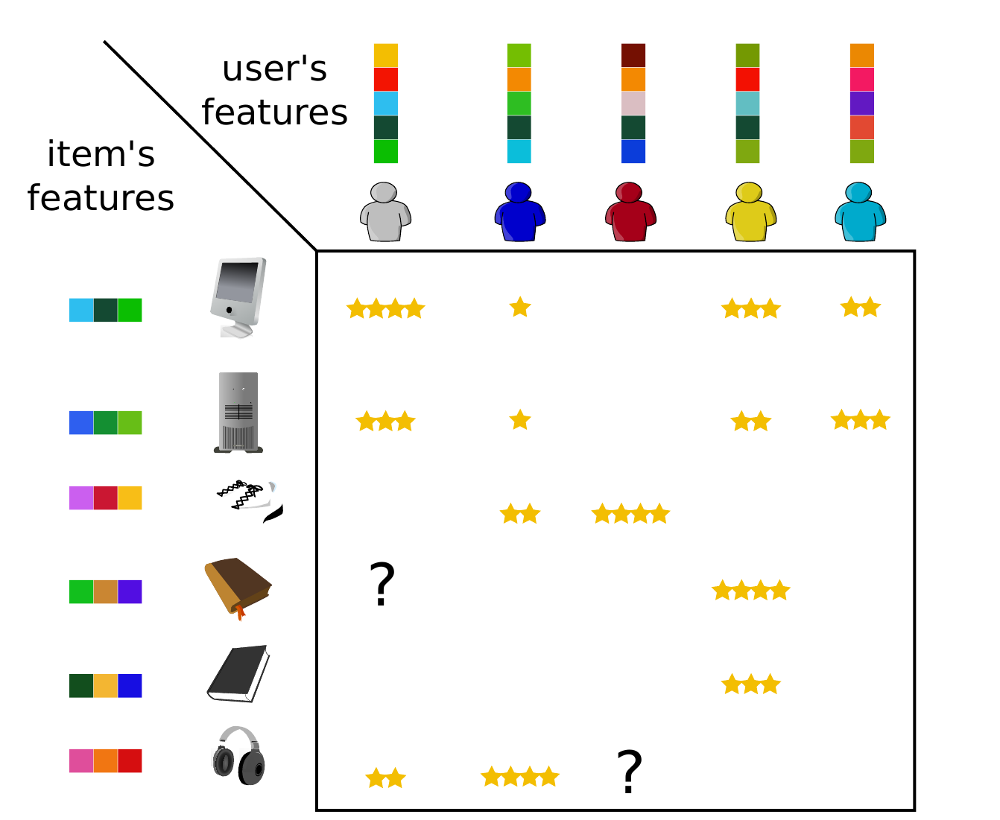</p>

The image above shows the sparsity pattern in our general user/item datasets, where white spaces represent missing ratings. This project is based on the **MovieLens** dataset, which contains ratings from **610 users** on **4980 movies**, with nearly **98% of the matrix entries missing**.


## Methods Implemented

1. **Matrix Factorization with Gradient Descent** [3]
    - Decomposes the rating matrix into low-rank user and movie feature matrices  $U, I \in \mathbb{R}^{n \times k}$, where $k$ is the latent dimensionality.

   <p align="center">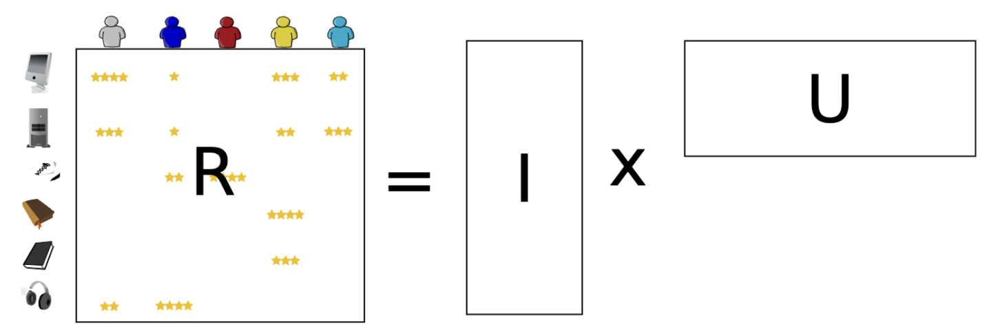</p>

   - Solve the following optimization problem using Gradient Descent : 

$$
\min_{I, U} \| R - IU^\top \|_F^2 \; + \; \lambda\|I\|_F^2 + \mu\|U\|_F^2
\quad \text{s.t.} \quad I \in \mathbb{R}^{m \times k}, \quad U \in \mathbb{R}^{n \times k}, \quad \| X \|_F^2 = \mathrm{tr}(X^\top X) 
$$

   
2. **Iterative PCA** [1][3][4] 
   - Uses Principal Component Analysis decomposition and iteratively to fill missing values

   <p align="center">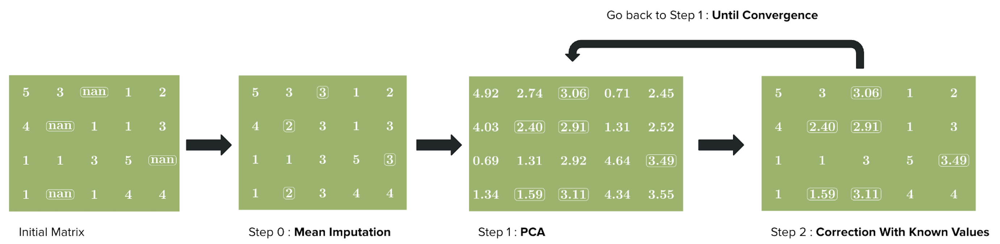</p>

   - With the additional orthogonality constraint, PCA act as a regularized version of the Matrix Factorization.

$$
\min_{U, I}  \| X - U \Sigma I^\top \|_F^2 \quad \text{s.t.} \quad U^\top U = I_k, \quad I^\top I = I_k
$$


3. **Kernel PCA** [2]
   - Non-linear extension of Iterative PCA for capturing complex patterns

   <p align="center">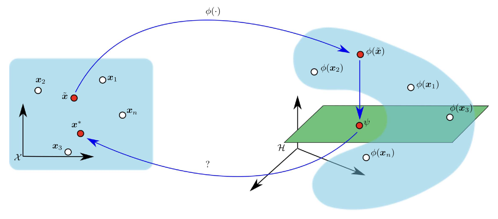</p>

   - Better suited for non-linear relationships in rating data

$$
K(x_i, x_j) = \exp\left(-\gamma \ \| x_i - x_j \|^2 \right)
$$
   

## Matrix Completion Results


### Training Curves

1. **Matrix Factorization**
<div align="center">
  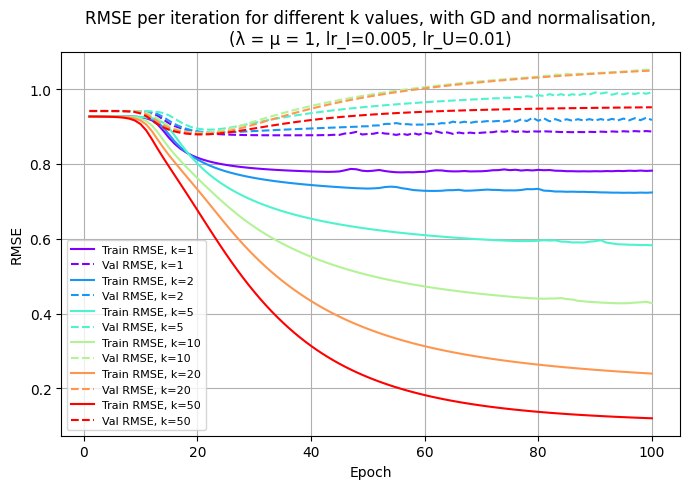
  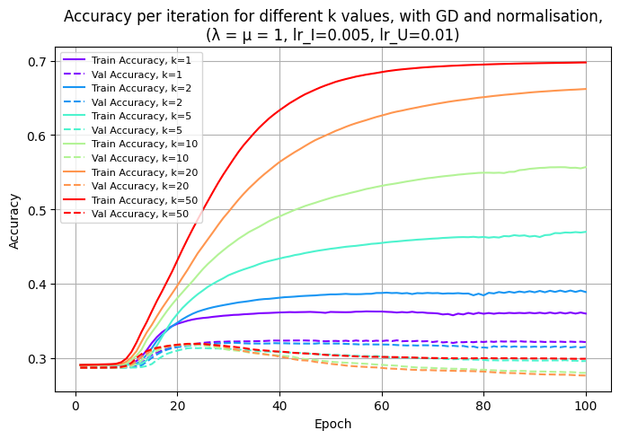
</div>

2. **Iterative PCA**
<div align="center">
  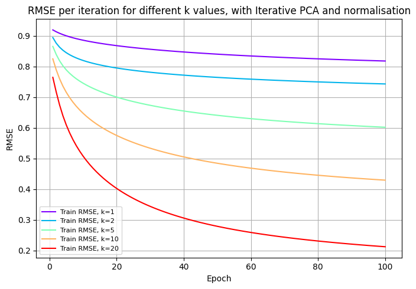
  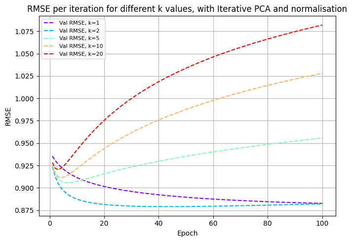
</div>

3. **Kernel Iterative PCA**
<div align="center">
  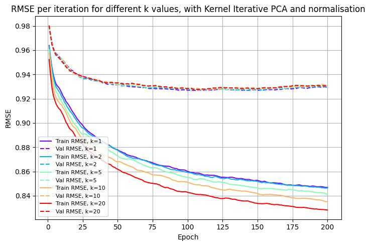
  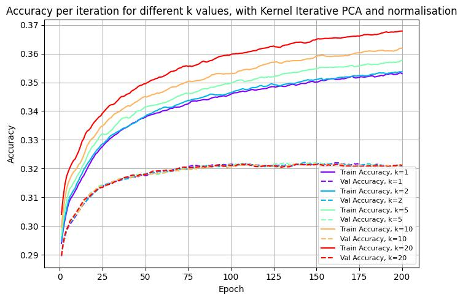
</div>


### Impact of Initialization and Imputation strategies on Iterative PCA

The initial imputation strategy in the Iterative PCA algorithm strongly influences convergence and reconstruction accuracy.
The plot below compares several normalization–imputation configurations:
- Centering by user mean or movie mean, then imputing missing values with zero.
- No normalization, imputing missing entries with the global, user, or movie mean.

Results show that handling user bias provides the lowest validation RMSE, outperforming global or movie-based imputations.

<p align="center">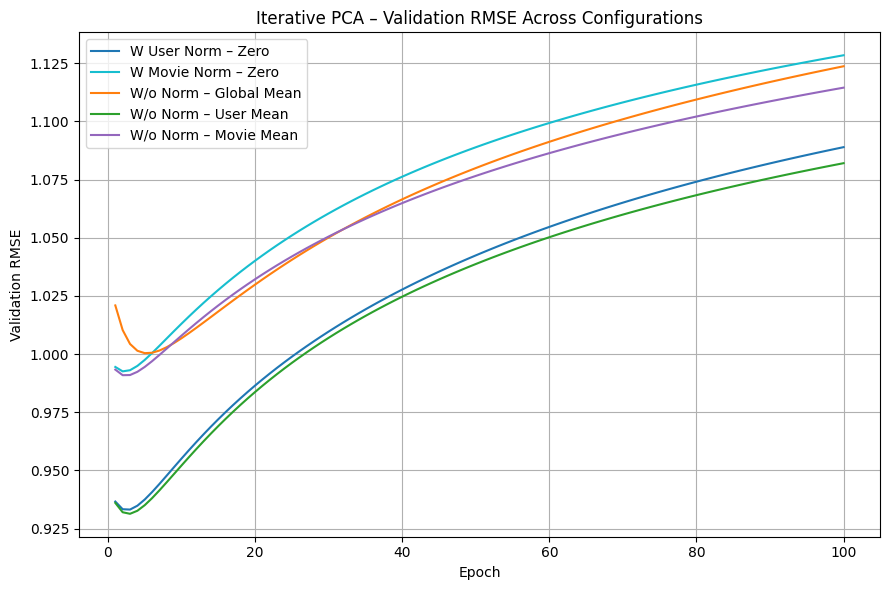</p>


### Model Performance Comparison

<div align="center">

| Model                          | Best RMSE | Exact Accuracy (%) | 
|--------------------------------|:----------:|:------------------:|
| Matrix Factorization (GD)      | **0.876**  | **0.322**          |
| Iterative PCA                  | 0.879      | 0.318              |
| Iterative Kernel PCA (RBF)     | 0.927      | **0.322**          |
</div>


## Requirements
- Python 3.8+
- Install dependencies:
   ```bash
   pip install -r requirements.txt
   ```

## Getting Started

1. Clone the repository

2. Create a Python environment and install dependencies

```bash
python -m venv .venv
source .venv/bin/activate   # macOS / Linux (zsh)
pip install -r requirements.txt
```

3. Prepare your data

- The scripts required the MovieLens dataset saved in a `data/` folder at the repository root. The expected filenames used by the example scripts are:
   - `data/ratings_train.npy`  (training split with NaNs for missing ratings)
   - `data/ratings_test.npy`   (validation/test split with NaNs for missing ratings)
   - `data/ratings_eval.npy`   (evaluation split with NaNs for missing ratings)

4. Run the example scripts in `sandbox/`

```bash
python sandbox/run_iterative_pca.py
python sandbox/run_iterative_kpca.py
python sandbox/run_gradient_descent.py
```

5. Using `generate.py` to complete a ratings table

```bash
python generate.py --name data/ratings_eval.npy
```

## References

[1] R. Vidal, Yi Ma, and S. S. Sastry. 2016. *Generalized Principal Component Analysis*. Springer Publishing Company, Incorporated, Section *Robustness Issues for PCA.*

[2] P. Honeine and C. Richard, “Preimage Problem in Kernel-Based Machine Learning,” *IEEE Signal Processing Magazine*, vol. 28, no. 2, pp. 77–88, March 2011.

[3] H. I. Alshbanat, H. Benhidour, and S. Kerarche, “A Survey of Latent Factor Models in Recommender Systems,” *Information Fusion*, vol. 117, p. 102905, May 2025.

[4] D. Kim and B.-J. Yum, “Collaborative Filtering Based on Iterative Principal Component Analysis,” *Department of Industrial Engineering, Korea Advanced Institute of Science and Technology (KAIST)*, Taejon, Korea.


